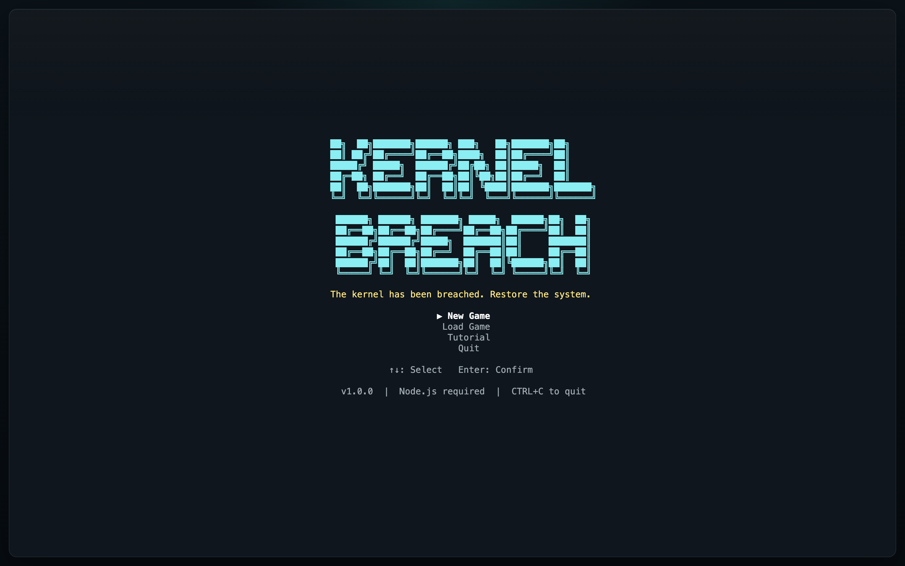
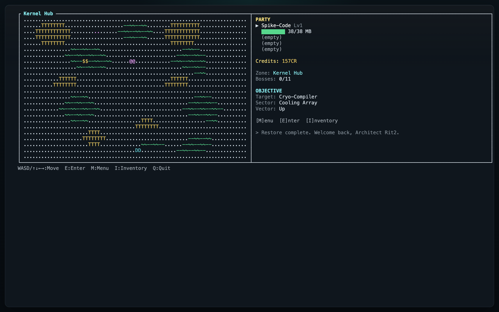
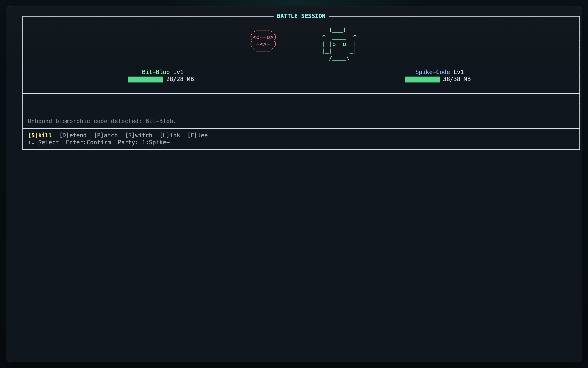
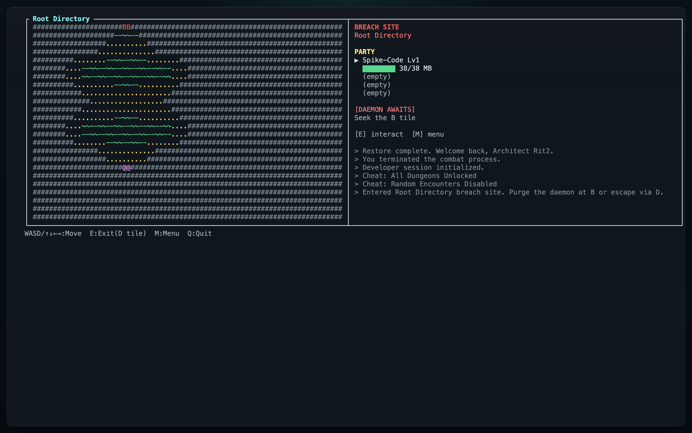
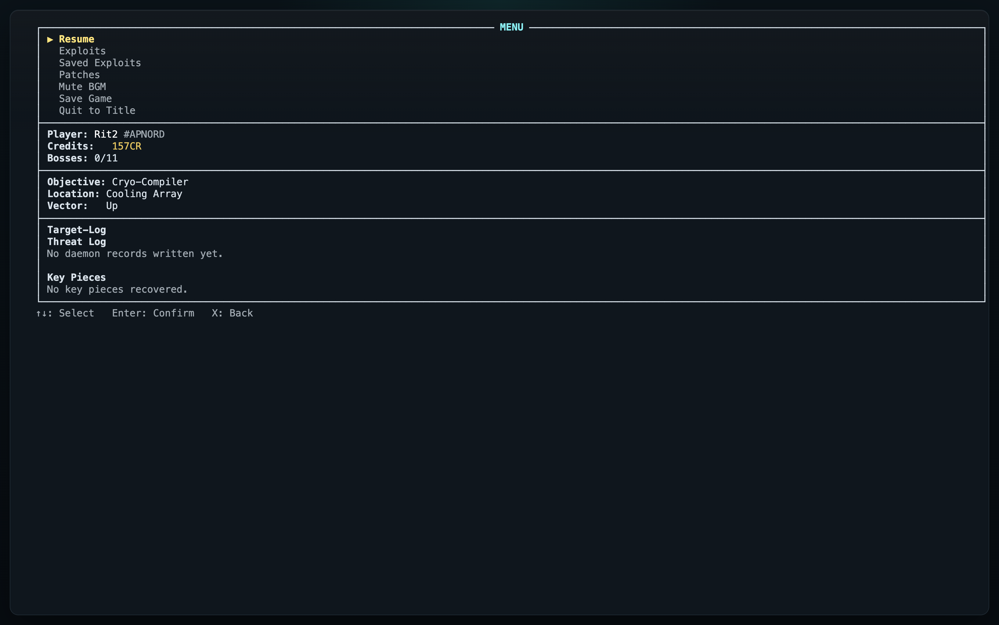

# Kernel Breach

Kernel Breach is released under the BSD 3-Clause License. See `LICENSE` for the full text.

Welcome to Kernel Breach, a hacker themed, Pokemon inspired, dungeon crawling creature capture RPG packed with security flavored mechanics, grindy progression, and just enough difficulty to be frustrating in the right way.

Behind every corner are surprises, hostile viruses, and corrupted sectors waiting to be purged. You are the lead Security Architect, tasked with stopping a deadly polymorphic code that has breached the kernel and now threatens to wipe the entire system with `sudo rm -rf /`.

Armed with sudo permissions and exploits of your own, you enter the world of the Terminal, where users meet machine and mysterious low-level operations unfold beneath the surface of the User Space. At first it may feel like magic, but the deeper you dive, the more systematic and scientific the journey becomes.

Explore the infected sectors of the disk, purge the polymorphic corruption spreading through them, and reclaim the system before it is lost forever!

## Screenshots

### Title



### Overworld



### Battle



### Breach Sites



### Menu



## Download And Play

Prebuilt packages are available from the Releases section of this repository.

Use the package for your operating system:

- macOS: download the `.dmg` or release zip, move the app to Applications if desired, then launch Kernel Breach.
- Windows: download the Windows release zip, extract it, then run the included `.exe` or installer.
- Linux: download the `.deb` package, install it with your system package tools, then launch Kernel Breach from the applications menu.

For Linux `.deb` packages, the install command is:

```bash
sudo dpkg -i kernelbreach_1.0.0_amd64.deb
```

This public repository is intended for players who want to inspect the game or use the official release builds.

## Updating

Kernel Breach does not auto-update or access the internet from inside the game. Optional updater scripts are provided in `update_scripts/` for players who want a quicker way to pull the latest release asset.

Release zip packages also include the updater script for that platform, so new players who download a zip already have the update workflow available in the game folder.

Run the updater for your platform from any directory where you saved the script. On macOS or Linux, make the script executable first:

```bash
chmod +x update-mac-arm64.sh
```

Then run the appropriate updater:

```bash
./update-mac-arm64.sh
./update-mac-x64.sh
./update-linux64.sh
```

If you are running from a cloned copy of this repository, you can also run the scripts from `update_scripts/`:

```bash
./update_scripts/update-mac-arm64.sh
./update_scripts/update-mac-x64.sh
./update_scripts/update-linux64.sh
```

On Windows, run PowerShell from the directory where you saved the script:

```powershell
powershell -ExecutionPolicy Bypass -File .\update-win64.ps1
```

The updater checks the latest GitHub release, exits if you are already current, or downloads and installs the latest direct release asset for your platform. Save files are stored separately from the app and are not removed by updating.

## Controls

- WASD or arrow keys: move
- E: interact / enter dungeon
- M: menu
- I: inventory
- Enter or Space: confirm
- X or Escape: back
- CTRL+C: quit

## Notes

- Save files are written to an OS-specific app data folder.
- macOS: `~/Library/Application Support/KernelBreach/saved_games`
- Linux: `${XDG_DATA_HOME:-~/.local/share}/KernelBreach/saved_games`
- Windows: `%APPDATA%\KernelBreach\saved_games`
